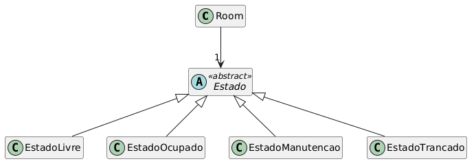
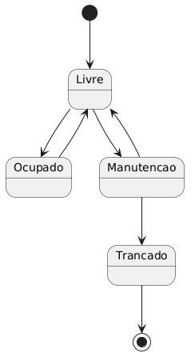

# State-DCC078-2026-3-A
## Tema:
Um sistema de gerenciamento de quartos, por exemplo de um hotel.

Os quartos possuem os estados "Livre", "Ocupado", "Manutenção" e "Trancado".
("Trancado" neste caso representando um quarto que não pode mais ser utilizado, tive preguiça de mudar o nome pra algo que fizesse mais sentido)
## Diagramas:
Diagrama de Classes

Diagrama de Estados

